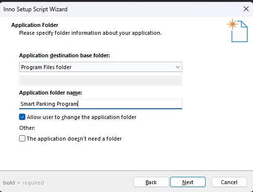
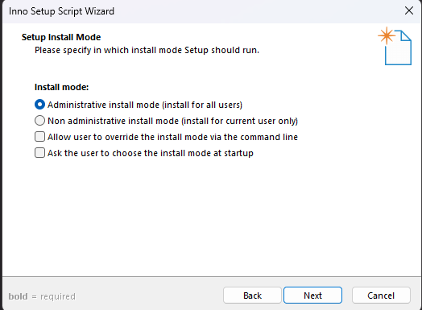

# Hướng dẫn cách đóng gói tệp exe thành một file cài đặt duy nhất

### Để đóng gói thành một file cài đặt duy nhất ta sử dụng Inno setup compiler

Tạo một folder chứa các tệp cần thiết như: file exe, các thư mục hình ảnh, log, ...  


Sau đó mở `inno setup compiler`:  


Sau đó chọn `Cretae a new script file using the Script Wizad` và nhấn `OK`. Và ấn `Next` khi hộp thoại mở lên.  


Tiếp theo điền các thông tin quan trọng về phần mềm như ảnh dưới:  


`Application name` sẽ là tên phần mềm mà bạn muốn hiển thị  
`Application version` là phiên bản phần mềm  
`Application publisher` là tên người tạo phần mềm  
`Application website` là trang web phần mềm nếu có  

Tiếp theo sẽ chọn nơi đặt thư mục phần mềm  



`Application destination base folder` là nơi đặt thư mục app, `Program Files Folder` sẽ là đặt ở ổ `C:/Program File (x86)`  
`Application folder name` là tên thư mục sẽ đặt ở mục `Program Files Folder`: Nên đặt là `Smart Parking Program`  

Sau đó cần thêm các tệp exe và thư mục cần thiết cho phần mềm  


Đầu tiên cần phải thêm tệp `exe là chương trình chính` để file cài đặt thêm vào, sau đó thêm các thư mục cần thiết như `image`, `data`, ... Chỉ cần thêm các thư muc chính, các file trong đó nó sẽ tự động copy vào  


Cần bỏ chọn vào mục `Associate a file type to the main executable`  


Ấn `next` và sau đó cung cấp các file license  


Sau đó chọn chế độ cài đặt yêu cầu quyền admin, như vậy nó sẽ cài đặt thằng vào thư mục `C:/Program File (x86)` Nếu không nó sẽ không có quyền cài đặt ở thư mục ổ C.  



Chọn ngôn ngữ mặc định là `English` và ấn next:  


Chọn nơi để xuất ra file cài đặt, đặt `tên cho file setup` và `icon` của file setup.  


Ấn `next` và `finish`  


Nó sẽ ra 1 file và nhớ chọn `No` để chỉnh sửa file này như sau.  


Chỉnh sửa file có một vài điểm sau:  
Chương trình của tôi có 2 tệp exe, trong đó có 1 tệp exe mang tên `Updater.exe` đây là chương trình dùng để cập nhật phần mềm chính, nó cần được thêm vào thư mục nên tôi đã thêm 1 dòng bên dưới dòng chứa ứng dụng chính của tôi là `#MyAppExeName` và `Updater.exe`  

```
[Files]
Source: "D:\Project\Smartparking_app\{#MyAppExeName}"; DestDir: "{app}"; Flags: ignoreversion
Source: "D:\Project\Smartparking_app\Updater.exe"; DestDir: "{app}"; Flags: ignoreversion
```

Các thư mục trong phần mềm của tôi cần phải chỉnh sửa để nó tạo ra thư mục đúng:  
Trong code của tôi truy cập các tệp theo đường dẫn `assets/image` và `data` nên ta cần thêm đúng chính xác thứ tự ta muốn tạo folder: `DestDir: "{app}/assets/image"`, `DestDir: "{app}/data"` Nếu không mặc định nó sẽ không tạo thư mục mà sẽ để hết vào cũng 1 chỗ `root`.  
```
[Files]
Source: "D:\Project\Smartparking_app\{#MyAppExeName}"; DestDir: "{app}"; Flags: ignoreversion
Source: "D:\Project\Smartparking_app\Updater.exe"; DestDir: "{app}"; Flags: ignoreversion
Source: "D:\Project\Smartparking_app\assets\image\*"; DestDir: "{app}/assets/image"; Flags: ignoreversion recursesubdirs createallsubdirs
Source: "D:\Project\Smartparking_app\data\*"; DestDir: "{app}/data"; Flags: ignoreversion recursesubdirs createallsubdirs
Source: "D:\Project\Smartparking_app\src\*"; DestDir: "{app}/src"; Flags: ignoreversion recursesubdirs createallsubdirs
```

Cuối cùng ấn `Compiler`  


Đợi một lúc để nó hoàn tất qusa trình đóng gói, ta sẽ được tệp cài đựt như sau:  


Và ta chỉ cần chạy file đó là quá trình cài đặt diễn ra như bình thường.